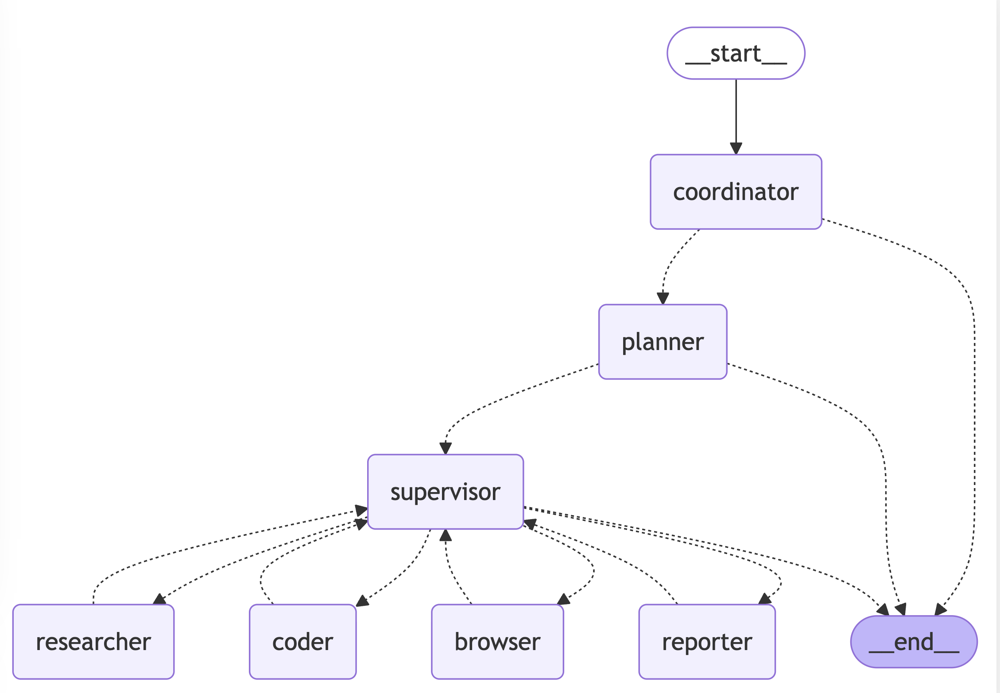

# 🦜🤖 Drona

[](https://www.python.org/downloads/)

[English](./README.md)

## Demo

**Task**: Calculate the influence index of DeepSeek R1 on HuggingFace. This index can be designed using a weighted sum of factors such as followers, downloads, and likes.

**Drona's Fully Automated Plan and Solution**:
1. Gather the latest information about "DeepSeek R1", "HuggingFace", and related topics through online searches.
2. Interact with a Chromium instance to visit the HuggingFace official website, search for "DeepSeek R1" and retrieve the latest data, including followers, likes, downloads, and other relevant metrics.
3. Find formulas for calculating model influence using search engines and web scraping.
4. Use Python to compute the influence index of DeepSeek R1 based on the collected data.
5. Present a comprehensive report to the user.


## Table of Contents

- [Quick Start](#quick-start)
- [Project Statement](#project-statement)
- [Architecture](#architecture)
- [Features](#features)
- [Why Drona?](#why-drona)
- [Setup](#setup)
    - [Prerequisites](#prerequisites)
    - [Installation](#installation)
    - [Configuration](#configuration)
- [Usage](#usage)
- [Docker](#docker)
- [Web UI](#web-ui)
- [Development](#development)
- [FAQ](#faq)
- [Contributing](#contributing)
- [License](#license)
- [Acknowledgments](#acknowledgments)

## Quick Start

```bash
# Clone the repository
git clone https://github.com/somilbansal/drona.git
cd drona

# Install dependencies, uv will take care of the python interpreter and venv creation
uv sync

# Playwright install to use Chromium for browser-use by default
uv run playwright install

# Configure environment
# Windows: copy .env.example .env
cp .env.example .env
# Edit .env with your API keys

# Run the project
uv run main.py
```

## Project Statement

This is an academically driven open-source project, developed by a group of former colleagues in our spare time. It aims to explore and exchange ideas in the fields of Multi-Agent and DeepResearch.

- **Purpose**: The primary purpose of this project is academic research, participation in the GAIA leaderboard, and the future publication of related papers.
- **Independence Statement**: This project is entirely independent and unrelated to our primary job responsibilities. It does not represent the views or positions of our employers or any organizations.
- **No Association**: This project has no association with Manus (whether it refers to a company, organization, or any other entity).
- **Clarification Statement**: We have not promoted this project on any social media platforms. Any inaccurate reports related to this project are not aligned with its academic spirit.
- **Contribution Management**: Issues and PRs will be addressed during our free time and may experience delays. We appreciate your understanding.
- **Disclaimer**: This project is open-sourced under the MIT License. Users assume all risks associated with its use. We disclaim any responsibility for any direct or indirect consequences arising from the use of this project.
## Architecture

Drona implements a hierarchical multi-agent system where a supervisor coordinates specialized agents to accomplish complex tasks:



The system consists of the following agents working together:

1. **Coordinator** - The entry point that handles initial interactions and routes tasks
2. **Planner** - Analyzes tasks and creates execution strategies
3. **Supervisor** - Oversees and manages the execution of other agents
4. **Researcher** - Gathers and analyzes information
5. **Coder** - Handles code generation and modifications
6. **Browser** - Performs web browsing and information retrieval
7. **Reporter** - Generates reports and summaries of the workflow results

## Features

### Core Capabilities

- 🤖 **LLM Integration**
    - It supports the integration of most models through [litellm](https://docs.litellm.ai/docs/providers). 
    - Support for open source models like Qwen
    - OpenAI-compatible API interface
    - Multi-tier LLM system for different task complexities

### Tools and Integrations

- 🔍 **Search and Retrieval**
    - Web search via Tavily API
    - Neural search with Jina
    - Advanced content extraction

### Development Features

- 🐍 **Python Integration**
    - Built-in Python REPL
    - Code execution environment
    - Package management with uv

### Workflow Management

- 📊 **Visualization and Control**
    - Workflow graph visualization
    - Multi-agent orchestration
    - Task delegation and monitoring

## Why Drona?

We believe in the power of open source collaboration. This project wouldn't be possible without the amazing work of projects like:

- [Qwen](https://github.com/QwenLM/Qwen) for their open source LLMs
- [Tavily](https://tavily.com/) for search capabilities
- [Jina](https://jina.ai/) for crawl search technology
- [Browser-use](https://pypi.org/project/browser-use/) for control browser
- And many other open source contributors

We're committed to giving back to the community and welcome contributions of all kinds - whether it's code, documentation, bug reports, or feature suggestions.

## Setup

### Prerequisites

- [uv](https://github.com/astral-sh/uv) package manager

### Installation

Drona leverages [uv](https://github.com/astral-sh/uv) as its package manager to streamline dependency management.
Follow the steps below to set up a virtual environment and install the necessary dependencies:

```bash
# Step 1: Create and activate a virtual environment through uv
uv python install 3.12
uv venv --python 3.12

source .venv/bin/activate  # On Windows: .venv\Scripts\activate

# Step 2: Install project dependencies
uv sync
```

By completing these steps, you'll ensure your environment is properly configured and ready for development.

### Configuration

Drona uses a three-layer LLM system, which are respectively used for reasoning, basic tasks, and vision-language tasks. Configuration is done using the `conf.yaml` file in the root directory of the project. You can copy `conf.yaml.example` to `conf.yaml` to start the configuration:
```bash
cp conf.yaml.example conf.yaml
```

```yaml
# Setting it to true will read the conf.yaml configuration, and setting it to false will use the original .env configuration. The default is false (compatible with existing configurations)
USE_CONF: true

# LLM Config
## Follow the litellm configuration parameters: https://docs.litellm.ai/docs/providers. You can click on the specific provider document to view the completion parameter examples
REASONING_MODEL:
  model: "volcengine/ep-xxxx"
  api_key: $REASONING_API_KEY # Supports referencing the environment variable ENV_KEY in the.env file through $ENV_KEY
  api_base: $REASONING_BASE_URL

BASIC_MODEL:
  model: "azure/gpt-4o-2024-08-06"
  api_base: $AZURE_API_BASE
  api_version: $AZURE_API_VERSION
  api_key: $AZURE_API_KEY

VISION_MODEL:
  model: "azure/gpt-4o-2024-08-06"
  api_base: $AZURE_API_BASE
  api_version: $AZURE_API_VERSION
  api_key: $AZURE_API_KEY
```

You can create a .env file in the root directory of the project and configure the following environment variables. You can copy the.env.example file as a template to start:
```bash
cp .env.example .env
```
```ini
# Tool API Key
TAVILY_API_KEY=your_tavily_api_key
JINA_API_KEY=your_jina_api_key  # Optional

# Browser Configuration
CHROME_INSTANCE_PATH=/Applications/Google Chrome.app/Contents/MacOS/Google Chrome  # Optional, the path to the Chrome executable file
CHROME_HEADLESS=False  # Optional, the default is False
CHROME_PROXY_SERVER=http://127.0.0.1:10809  # Optional, the default is None
CHROME_PROXY_USERNAME=  # Optional, the default is None
CHROME_PROXY_PASSWORD=  # Optional, the default is None
```


> **Note:**
>
> - The system uses different models for different types of tasks:
>     - The reasoning LLM is used for complex decision-making and analysis.
>     - The basic LLM is used for simple text tasks.
>     - The vision-language LLM is used for tasks involving image understanding.
> - The configuration of all LLMs can be customized independently.
> - The Jina API key is optional. Providing your own key can obtain a higher rate limit (you can obtain this key at [jina.ai](https://jina.ai/)).
> - The default configuration for Tavily search is to return up to 5 results (you can obtain this key at [app.tavily.com](https://app.tavily.com/)). 

### Configure Pre-commit Hook

Drona includes a pre-commit hook that runs linting and formatting checks before each commit. To set it up:

1. Make the pre-commit script executable:

```bash
chmod +x pre-commit
```

2. Install the pre-commit hook:

```bash
ln -s ../../pre-commit .git/hooks/pre-commit
```

The pre-commit hook will automatically:

- Run linting checks (`make lint`)
- Run code formatting (`make format`)
- Add any reformatted files back to staging
- Prevent commits if there are any linting or formatting errors

## Usage

### Basic Execution

To run Drona with default settings:

```bash
uv run main.py
```

### API Server

Drona provides a FastAPI-based API server with streaming support:

```bash
# Start the API server
make serve

# Or run directly
uv run server.py
```

The API server exposes the following endpoints:

- `POST /api/chat/stream`: Chat endpoint for LangGraph invoke with streaming support
    - Request body:
  ```json
  {
    "messages": [{ "role": "user", "content": "Your query here" }],
    "debug": false
  }
  ```
    - Returns a Server-Sent Events (SSE) stream with the agent's responses

### Advanced Configuration

Drona can be customized through various configuration files in the `src/config` directory:

- `env.py`: Configure LLM models, API keys, and base URLs
- `tools.py`: Adjust tool-specific settings (e.g., Tavily search results limit)
- `agents.py`: Modify team composition and agent system prompts

### Agent Prompts System

Drona uses a sophisticated prompting system in the `src/prompts` directory to define agent behaviors and responsibilities:

#### Core Agent Roles

- **Supervisor ([`src/prompts/supervisor.md`](src/prompts/supervisor.md))**: Coordinates the team and delegates tasks by analyzing requests and determining which specialist should handle them. Makes decisions about task completion and workflow transitions.

- **Researcher ([`src/prompts/researcher.md`](src/prompts/researcher.md))**: Specializes in information gathering through web searches and data collection. Uses Tavily search and web crawling capabilities while avoiding mathematical computations or file operations.

- **Coder ([`src/prompts/coder.md`](src/prompts/coder.md))**: Professional software engineer role focused on Python and bash scripting. Handles:

    - Python code execution and analysis
    - Shell command execution
    - Technical problem-solving and implementation

- **File Manager ([`src/prompts/file_manager.md`](src/prompts/file_manager.md))**: Handles all file system operations with a focus on properly formatting and saving content in markdown format.

- **Browser ([`src/prompts/browser.md`](src/prompts/browser.md))**: Web interaction specialist that handles:
    - Website navigation
    - Page interaction (clicking, typing, scrolling)
    - Content extraction from web pages

#### Prompt System Architecture

The prompts system uses a template engine ([`src/prompts/template.py`](src/prompts/template.py)) that:

- Loads role-specific markdown templates
- Handles variable substitution (e.g., current time, team member information)
- Formats system prompts for each agent

Each agent's prompt is defined in a separate markdown file, making it easy to modify behavior and responsibilities without changing the underlying code.

## Docker

Drona can be run in a Docker container. default serve api on port 8000.

Before run docker, you need to prepare environment variables in `.env` file.

```bash
docker build -t drona .
docker run --name drona -d --env-file .env -e CHROME_HEADLESS=True -p 8000:8000 drona
```

You can also just run the cli with docker.

```bash
docker build -t drona .
docker run --rm -it --env-file .env -e CHROME_HEADLESS=True drona uv run python main.py
```

## Web UI

Drona provides a default web UI.

Please refer to the [drona/drona-web-ui](https://github.com/drona/drona-web) project for more details.

## Docker Compose (include both backend and frontend)

Drona provides a docker-compose setup to easily run both the backend and frontend together:

```bash
# Start both backend and frontend
docker-compose up -d

# The backend will be available at http://localhost:8000
# The frontend will be available at http://localhost:3000, which could be accessed through web browser
```

This will:
1. Build and start the Drona backend container
2. Build and start the Drona web UI container
3. Connect them using a shared network

** Make sure you have your `.env` file prepared with the necessary API keys before starting the services. **

## Development

### Testing

Run the test suite:

```bash
# Run all tests
make test

# Run specific test file
pytest tests/integration/test_workflow.py

# Run with coverage
make coverage
```

### Code Quality

```bash
# Run linting
make lint

# Format code
make format
```